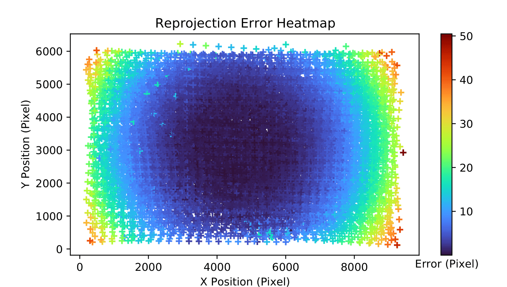
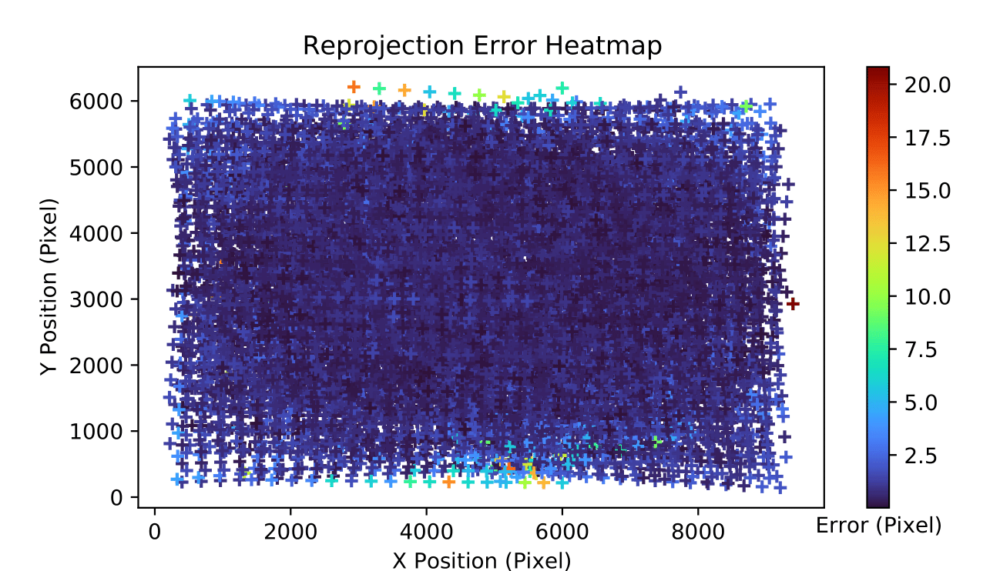
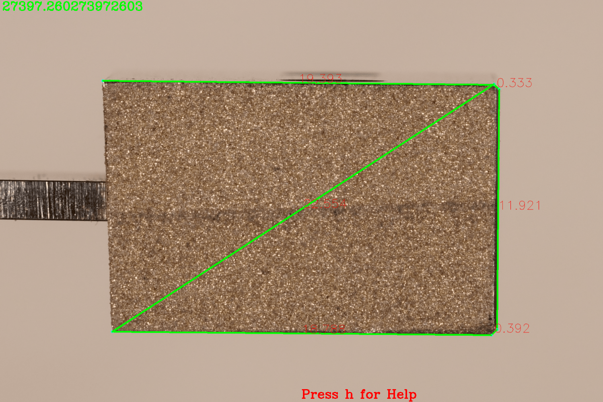
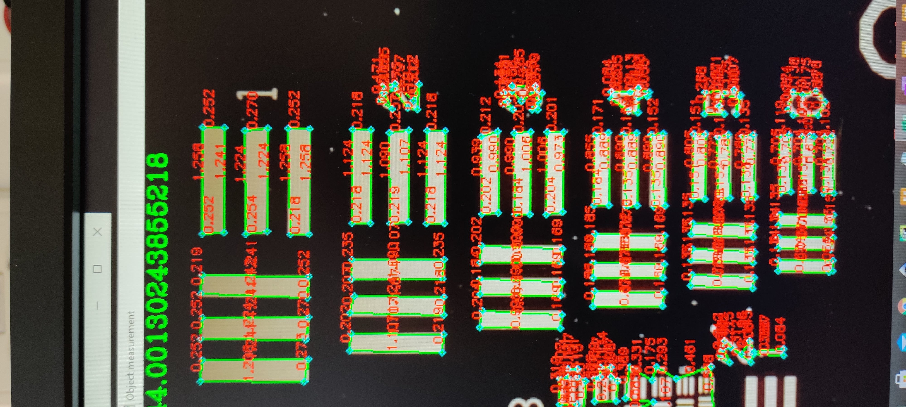

# CameraCalibration

## Description
In this Project I wanted to create a measuring system using a camera, that can be used to measure distances on a 2D Plane. It was part of my Bachelor Thesis: "Development of an optical measuring system with integrated calibration".\
This can be helpful for example for PCB inspection.

  

To active this multiple steps had to be done. For example, the Camera needs to be calibrated.\
For this I wrote a function that uses Zhangs method used in OpenCV. It is located in CalibrationWithUncertainty.py. 
It can calculate the uncertainty of the calibration over multiple runs, save the result in a .pickle file and visualize the results in Matplotlib.

   
  

## Short Instructions
The actual Measurement is done after the calibration. The main entry Point is mainR4.py for images (taken for example by an DSLR).
On the Image you want to measure, there needs to be an AruCo marker with known size. This marker needs to be in the same plane seen from the camera.\
You can either measure distances manually by dragging lines or use the "Automatic" mode which tries to measure high contrast edges using Canny edge detection.
You can play with the Canny parameters in the Settings window.

  
  

